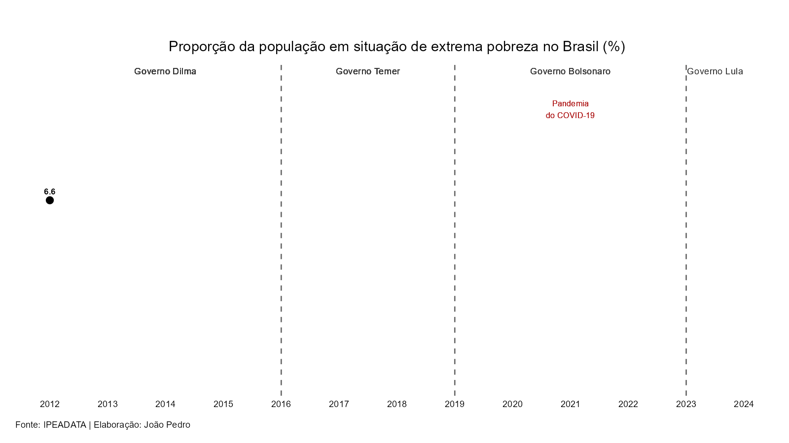

---
format:
  html:
    output-file: "extrema_pobreza_br"
    fontsize: "12pt"
    title-block-render: false 
    embed-resources: true
    number-sections: true
    lang: pt
execute:
  warning: false
  message: false
---

<div style="text-align: center; padding-top: 40px; padding-bottom: 40px;">
  <h1 style="font-size: 2em; font-weight: bold; margin-bottom: 25px;">
    Análise da Evolução da Extrema Pobreza no Brasil (2012 - 2024)
  </h1>
  <p style="font-size: 1.2em; margin-bottom: 5px;">João Pedro</p>
  <p style="font-size: 1.1em; color: #666;">24 de março de 2026</p>
</div>

Segundo o IBGE, a partir de critérios do Banco Mundial, é definido como extrema pobreza o grupo de pessoas com rendimento domiciliar per capita inferior a US$ 2,15 por dia. A partir de bases de dados públicas, é possível analisar essas informações de forma mais automatizada e integrada ao ambiente do R, o que permite acompanhar a evolução desses indicadores e contribuir para o debate sobre políticas públicas voltadas a redução da extrema pobreza no Brasil.

O gráfico retrata uma queda inicial entre 2012 e 2014 no Brasil, durante o Governo Dilma, quando o indicador passou de 6,6% para 5,2%, seguida de um aumento entre 2015 e 2019, abrangendo a transição para o Governo Temer e o início do Governo Bolsonaro, alcançando 7,4%. Em 2020, houve redução para 6,1%. Contudo, sob o impacto da Pandemia do COVID-19, em 2021 a extrema pobreza atingiu 9,0%, o maior valor da série. A partir de 2022 observa-se uma trajetória de queda que se consolida no Governo Lula, chegando a 3,5% em 2024 , após recuar de 4,4% em 2023, o que representa uma redução de 0,9 ponto percentual.



Para a criação do gráfico, foi seguido os seguintes passos:

# Instalação dos pacotes necessários
Nesta etapa, instalamos e carregamos os seguintes pacotes:

* `tidyverse`: Conjunto de pacotes para manipulação e visualização de dados
* `ggplot2`: Criação e visualização dos dados a partir de gráficos
* `ipeadatar`: Extração dos dados sobre a extrema pobreza no Brasil
* `lubridate`: Manipulação de datas
* `kableExtra`: Criação de tabelas personalizadas
* `knitr`: Criação de tabelas e gráficos dinâmicos
* `pacman` e `gganimate`: Criação de gráficos animados

```{r}
# Instalação de todos os pacotes necessários
# install.packages(c("tidyverse", "sidrar", "ipeadatar", "lubridate", "kableExtra", "pacman", "gganimate"))

library(tidyverse)
library(ggplot2)
library(ipeadatar)
library(lubridate)
library(kableExtra)
library(knitr)
library(pacman)
library(gganimate)
library(gifski)
```

# Analisar todas as séries do IPEADATA
```{r}
temas = search_series()
View(temas)
```

# Baixar dados do IPEADATA sobre a extrema pobreza
```{r}
dados <- ipeadata("PNADCA_TXPPCC215") %>%
    filter(tcode == 0) %>% 
    filter(date >= as.Date("2010-01-01")) %>%
    select(date, percentual_pobreza = value)
```

# Criação da tabela
```{r}
#| tbl-cap: "Tabela: Proporção de pessoas na extrema pobreza no Brasil (2012-2024)"
#| echo: true
#| message: false
#| warning: false

# 1. Tratamento completo
dados_formatados <- dados %>%
  mutate(
    Ano = year(date),
    `Extrema Pobreza (%)` = format(round(percentual_pobreza, 1), 
    nsmall = 1, 
    decimal.mark = ",")) %>%
  select(Ano, `Extrema Pobreza (%)`)

# 2. Gerando a tabela
dados_formatados %>%
  kable(
    align = "cc",
    escape = FALSE
  ) %>%
  kable_classic(
    full_width = FALSE, 
    html_font = "Times New Roman",
    lightable_options = "basic"
  ) %>%
  row_spec(0, bold = TRUE) %>%
  kable_styling(position = "center")
```

# Criação do gráfico: Evolução da extrema pobreza no Brasil (2012 - 2024)
```{r}
#| echo: true
#| results: "hide"
#| message: false
#| warning: false

# Localidade
Sys.setlocale("LC_ALL", "Portuguese_Brazil.1252")

# Pacotes
if (!require("pacman")) install.packages("pacman")

pacman::p_load(
  tidyverse,
  gganimate,
  transformr,
  gifski,
  ragg
)

# Tratamento dos dados
dados_animacao <- dados_formatados %>%
  mutate(
    Valor_Num = as.numeric(str_replace(`Extrema Pobreza (%)`, ",", ".")),
    Ano_Num = as.numeric(Ano)
  ) %>%
  arrange(Ano_Num)

# Criando rótulos

governos <- tibble(
  xmin  = c(2012, 2016, 2019, 2023),
  xmax  = c(2016, 2019, 2023, 2024),
  label = c("Governo Dilma", "Governo Temer", "Governo Bolsonaro", "Governo Lula"),
  x_mid = c(2014, 2017.5, 2021, 2023.5)
)

pandemia <- tibble(
  xmin  = 2020,
  xmax  = 2022,
  label = "Pandemia\ndo COVID-19",
  x_mid = 2021
)

anos_frames <- sort(unique(dados_animacao$Ano_Num))

governos_frames <- governos %>%
  crossing(frame_ano = anos_frames) %>%
  filter(frame_ano >= xmin)

pandemia_frames <- pandemia %>%
  crossing(frame_ano = anos_frames) %>%
  filter(frame_ano >= xmin)

# Gráfico

p <- ggplot(dados_animacao, aes(x = Ano_Num, y = Valor_Num)) +

  geom_text(
    data = governos_frames,
    aes(x = x_mid, y = Inf, label = label,
        group = interaction(label, frame_ano)),
    vjust = 1.5,
    fontface = "plain",
    size = 3.2,
    color = "gray20",
    inherit.aes = FALSE
  ) +

  geom_text(
    data = pandemia_frames,
    aes(x = x_mid, y = Inf, label = label,
        group = frame_ano),
    vjust = 3.0,
    fontface = "plain",
    size = 2.8,
    color = "firebrick",
    inherit.aes = FALSE
  ) +

  geom_vline(xintercept = c(2016, 2019, 2023),
             linetype = "dashed", color = "gray40", linewidth = 0.6) +

  geom_line(aes(group = 1), color = "black", linewidth = 1) +

  geom_point(color = "black", size = 3) +

  geom_text(
    aes(label = sprintf("%.1f", Valor_Num)),
    vjust = -1,
    size = 3,
    fontface = "bold",
    color = "black"
  ) +

  labs(
    title = "Proporção da população em situação de extrema pobreza no Brasil (%)",
    x = NULL,
    y = "",
    caption = "Fonte: IPEADATA | Elaboração: João Pedro"
  ) +

  scale_x_continuous(breaks = seq(2012, 2024, 1)) +
  scale_y_continuous(
    limits = c(0, max(dados_animacao$Valor_Num) + 2),
    labels = NULL
  ) +

  coord_cartesian(clip = "off") +

  theme_minimal() +

  theme(
    plot.title         = element_text(face = "bold", size = 14, hjust = 0.5),
    panel.grid.minor   = element_blank(),
    panel.grid.major.y = element_blank(),
    panel.grid.major.x = element_blank(),
    axis.text.x        = element_text(color = "black"),
    axis.text.y        = element_blank(),
    plot.caption       = element_text(hjust = 0),
    plot.margin        = margin(t = 40, r = 10, b = 10, l = 10)
  )

# Animação

anim <- p +
  transition_reveal(Ano_Num)

animacao <- animate(
  anim,
  nframes   = 250,
  duration  = 18,
  end_pause = 80,
  renderer  = gifski_renderer(),
  width     = 1600,
  height    = 900,
  units     = "px",
  res       = 150,
  device    = "ragg_png"
)

# Salvando em formato de gif
anim_save("extrema_pobreza.gif", animation = animacao)
```